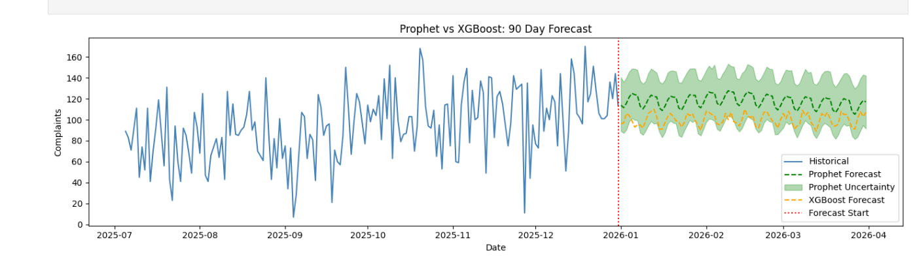

# Complaint Volume Forecasting

## Overview
- Forecasts daily complaint volumes for the next 90 days using 3 years of historical operational data (2023–2025).
- Supports capacity planning, triage resourcing, and team prioritisation.

---

## Quick Start & Reproducibility

Follow these steps to clone the repository, set up an isolated virtual environment, install dependencies, and run the pipeline from scratch:

```bash
# 1. Navigate to your preferred workspace directory (e.g., a TEST folder)
cd /path/to/your/TEST

# 2. Download the project files directly from the GitHub repository
git clone https://github.com/Lua-Matlab-Python-R-J2EE/ombudsman-complaints-forecast

# 3. Move your terminal inside the downloaded project folder
cd ombudsman-complaints-forecast

# 4. Create an isolated virtual environment to prevent package conflicts
python3 -m venv test_env

# 5. Activate the virtual environment
source test_env/bin/activate

# 6. Upgrade the package installer, install dependencies, and ensure Jupyter is available
pip install --upgrade pip
pip install -r requirements.txt
pip install notebook

# 7. Launch the notebook environment
jupyter notebook notebooks/pds_task.ipynb

```

### Reproducibility Verification
To guarantee identical outputs, perform the following validation steps inside the Jupyter interface:
1. Click **Kernel** from the top menu bar.
2. Select **Restart & Run All** to execute the pipeline sequentially from a fresh state.
3. Once execution completes, the pipeline automatically saves the final clean predictions to `outputs/forecast_90_days.csv`.

---

## Project Structure
```text
complaints-forecast/
├── config.py
├── data/                          # Raw input dataset
│   └── data.xlsx
├── notebooks/                     # Development notebooks
│   └── pds_task.ipynb             # Main notebook (end-to-end)
├── outputs/                       # Forecast CSV output
│   ├── forecast_90_days.csv       # 90-day forecast (XGBoost + Prophet)
│   └── forecast_chart.png         # XGBoost + Prophet results display
├── requirements.txt               # Python dependencies
├── .gitignore               
└── README.md
```

## Approach & Process

### 1. Data Cleaning
- Dropped 10 rows where target variable (`complaints`) was missing (~1% of data).
- Forward-filled operational features (`staffing_level_fte`, `backlog_days`, `channel_mix_index`) — assumes short-term stability.
- Dropped `centered_7d_mean` — uses future data, causes leakage.
- Converted `complaints` to integer after null removal.

### 2. Exploratory Data Analysis
- Trend: Clear upward trajectory: complaints grew from ~70/day (2023) to ~130/day (2025).
- Weak bimodal seasonality: spring (Mar-May) and autumn (Oct-Nov) peaks.
- High day-to-day variance throughout — difficult to predict individual days.

### 3. Feature Engineering

| Feature | Description |
|---|---|
| `day_of_week` | 0=Monday, 6=Sunday (maps weekly operational rhythms) |
| `is_weekend` | Binary flag (1 if Saturday/Sunday, else 0; captures closure periods) |
| `bank_holiday_flag` | Binary indicator for official public holidays and processing closures |
| `month` | 1–12, captures macro bimodal annual seasonal patterns |
| `year` | Integer value serving as a macro trend growth proxy |
| `lag_1` | Yesterday's complaints (immediate demand momentum) |
| `lag_7` | Same day last week (week-over-week operational consistency) |
| `rolling_mean_7` | Past 7-day backward moving average (smoothed localized trend) |


### 4. Train / Validation / Test Split (Chronological Matrix)

The dataset is partitioned into strict, non-overlapping chronological segments. To preserve the time-series structure and eliminate lookahead data leakage, the splits are mapped using exact 90-day forward calendars to match the required operational forecasting horizon:

-   **Train Set:** 2023-01-08 -to- 2025-07-04 (863 rows)
-   **Validation Set:** 2025-07-05 -to- 2025-10-02 (Exactly 90 calendar days) => out-of-sample window used for hyperparameter optimization via Optuna.
-   **Test Set:** 2025-10-03 -to- 2025-12-31 (Exactly 90 calendar days) => pristine holdout window used exclusively for final evaluation.

> Note: All 7 days of the week are preserved within these blocks. Weekends are tracked continuously using the engineered `is_weekend` flag to allow both models to natively map weekly volume reductions.*


---

## Models

**Target variable:** `complaints` — daily count of complaints received

### XGBoost
- Gradient Boosting (GB) model.
- Hyperparameters tuned using Optuna (50 trials, minimising validation MAE).
- 90-day forecast via recursive loop — lag features updated with each prediction.
- Limitation: recursive forecasting causes predictions to converge toward the mean.

**Input features:**

| Feature | Description |
|---|---|
| `day_of_week` | 0=Monday, 6=Sunday |
| `month` | 1–12 |
| `year` | 2023, 2024, 2025 |
| `is_weekend` | 1 if Saturday/Sunday, else 0 |
| `bank_holiday_flag` | 1 if public holiday, else 0 |
| `staffing_level_fte` | Staffing level in Full Time Equivalents (FTE) |
| `backlog_days` | Number of days behind on resolving complaints |
| `media_mentions` | Count of media/social mentions that day |
| `channel_mix_index` | 0–100 index representing complaint channel distribution |
| `lag_1` | Previous day's complaints |
| `lag_7` | Complaints from 7 days ago |
| `rolling_mean_7` | Average complaints over previous 7 days |

### Prophet (Facebook)
- Additive time series model — handles trend and seasonality natively.
- Models trend and seasonality directly without requiring manual autoregressive feature matrices.
- UK 2026 bank holidays sourced from [gov.uk](https://www.gov.uk) and injected as explicit event regressors.
- No recursive loop needed — forecasts all 90 days in one pass.
- Provides uncertainty intervals (`yhat_lower`, `yhat_upper`) — useful for capacity planning.

**Input Matrices & Regressors:**


| Feature / Array Name | Source | Description |
|---|---|---|
| `ds` | Data Index | Date of observation |
| `y` | `complaints` | Target variable — discrete daily counts |
| `holidays` | External Dataframe | Authoritative list of UK bank holidays passed directly to isolate holiday drops |


---

## Evaluation & Metrics

To ensure full transparency for operational directors, performance is evaluated using a targeted suite of metrics. Errors are structured to map directly to real-world frontline headcount risks:

*   **MAE (Mean Absolute Error) - Primary Metric:** Measures the average absolute daily case miss. Because it scales linearly and maps 1:1 to actual casework units, resource planning teams can translate this score directly into frontline staff and FTE capacity adjustments. It handles low-volume weekends safely without distorting the final baseline.
*   **RMSE (Root Mean Squared Error) - Variance Tracker:** Squares errors before averaging, penalising large misses heavily. Comparing RMSE against MAE serves as a risk flag to check if a model is prone to catastrophic under-forecasting during high-volume demand surges.
*   **MAPE (Mean Absolute Percentage Error) - Explicitly Rejected:** Included for reference only but completely ignored for model selection. Daily volumes drop close to zero on weekends and closures. When actual counts are tiny, minor absolute errors create exploded, artificial percentage spikes that distort true model utility.

### Performance Summary Scorecard

| Performance Metric | XGBoost (Tuned) | Meta Prophet | Final Winner | Operational Gain |
| :--- | :---: | :---: | :---: | :--- |
| **Mean Absolute Error (MAE)** | 29.63 | **23.47** | **Meta Prophet** | ~21% Accuracy Improvement |
| **Root Mean Squared Error (RMSE)** | 36.32 | **29.40** | **Meta Prophet** | ~19% Reduction in Large Misses |
| **Mean Absolute Percentage Error (MAPE)** | 34.69% | **32.85%** | **Meta Prophet** | Volatile metric (denominator instability) |



### Final Model Selection Decision
**Meta Prophet is the selected production model.** It consistently outperforms the optimized XGBoost architecture across all evaluation criteria on completely unseen holdout data. 

From a workforce scheduling perspective, relying on an over-smoothed point estimation introduces operational vulnerability. Meta Prophet delivers higher baseline accuracy, tracks true historical variance without suffering from the recursive smoothing degradation seen in XGBoost, and generates explicit statistical uncertainty boundaries (`yhat_lower`, `yhat_upper`) to support risk-managed capacity planning.


---

## Limitations

1. **Recursive smoothing (XGBoost):** Forecast variance (std ~4) far lower than historical (std ~25) — lag features converge to mean after ~14 days as predictions replace real data.
2. **Compounding errors (XGBoost):** Each recursive prediction feeds into the next — errors accumulate over the 90-day horizon, making later predictions less reliable.
3. **Unexplained anomalies:** e.g. 2025-11-27 shows near-zero complaints with no weekend or bank holiday flag — model cannot predict unrecorded events such as system outages, strikes, or unplanned closures.
4. **Operational features assumed stable:** `staffing_level_fte`, `backlog_days`, and `channel_mix_index` held at last known value over 90-day forecast horizon — any real changes will not be reflected in the forecast.
5. **Media mentions assumed zero:** Future news or social media events cannot be anticipated — model will underpredict complaint volumes on high-media days.
6. **Incomplete bank holiday flags in training data:** `2025-05-05` (Early May bank holiday) was not flagged in the source dataset — model treats this as a normal weekday during training, potentially underestimating bank holiday effects.
7. **Bank holiday flags are approximate:** Source dataset flags were not independently verified against an authoritative calendar for all 3 years — validated against UK Gov calendar for 2026 forecast period only.
8. **Limited Historical Data:** The total dataset spans only ~1,053 days, leaving just 863 rows for the training set after splitting. This short window restricts how robustly the models can learn long-term macro seasonal patterns.
9. **MAPE Unreliability:** Volatile percentage spikes on low-volume weekends distort results (see full breakdown in the Evaluation & Metrics section).
10. **XGBoost Tree Extrapolation Constraint:** In the recursive loop, the `year` feature passes a value of `2026` to the model. Because tree-based models split on historical thresholds rather than coefficients, XGBoost cannot extrapolate trends out-of-distribution. It treats 2026 exactly like the 2025 training ceiling, artificially capping and flattening the macro growth trajectory.


---

## Abbreviations


| Abbreviation | Full Form |
|---|---|
| MAE | Mean Absolute Error |
| RMSE | Root Mean Squared Error |
| MAPE | Mean Absolute Percentage Error |
| FTE | Full Time Equivalent |
| GB | Gradient Boosting |
| XGB | XGBoost (Extreme Gradient Boosting) |
| CSV | Comma Separated Values |
| UK | United Kingdom |
| std | Standard Deviation |